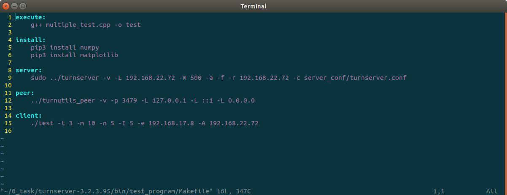
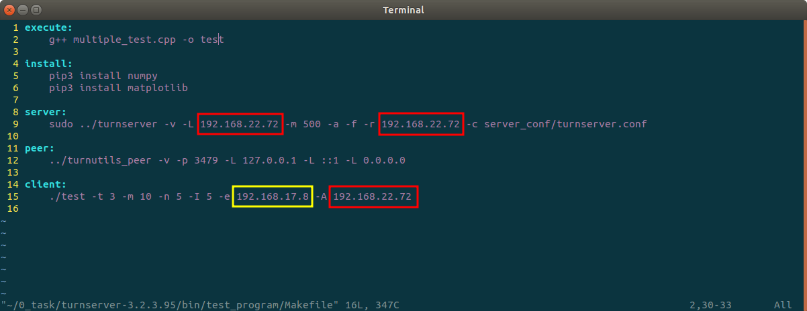
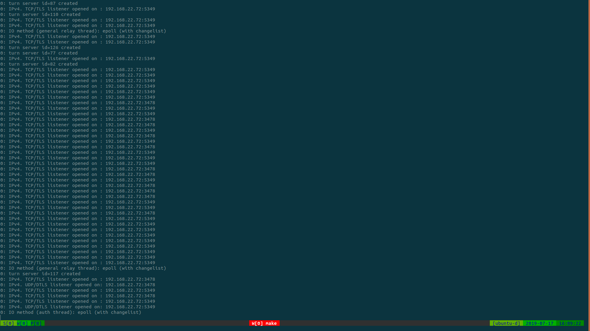
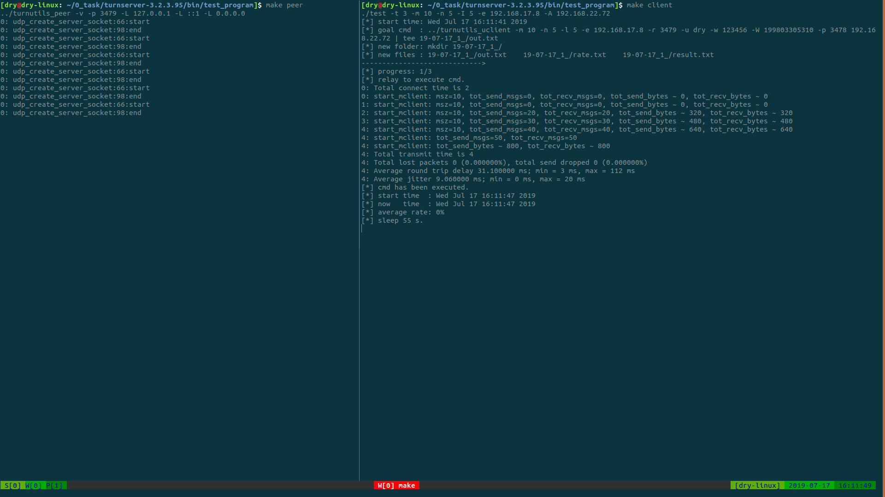
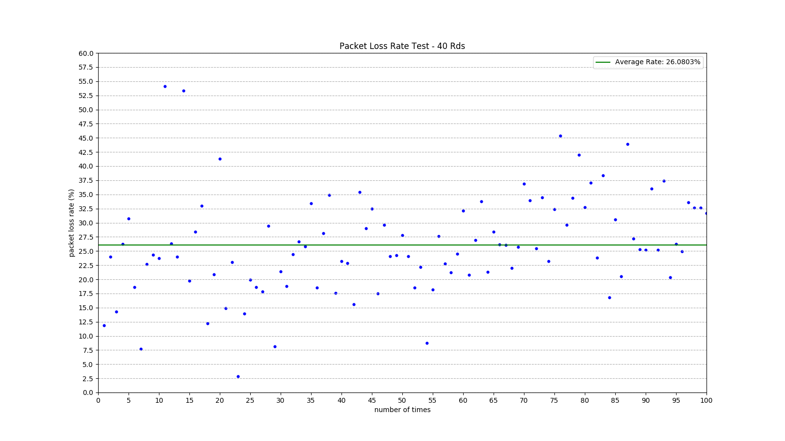

# TURN-Server Multiple Test Program

## 1. 前提

### 1.1. 准备 Linux 操作系统（建议[Ubuntu 18.04.2 LTS](https://ubuntu.com/download/desktop)）

### 1.2. 下载当前操作系统适用的 [turnserver-3.2.3.95](http://turnserver.open-sys.org/downloads/v3.2.3.95/)

### 1.4. 安装依赖 `OpenSSL`, `Libevent`

```shell
$ sudo apt install openssl openssl-devel openssl-libs libevent libevent-devel
    ...
```

### 1.5. 编译 & 安装 turnserver

```shell
$ cd turnserver-3.2.3.95/
$ ./configure
    ...
$ sudo make && sudo make install
    ...
```

## 2. 准备

### 2.1. 将 `TURN-Server-Test/` 整个目录拷贝到 turnserver 源代码编译生成的 `bin/` 目录下

### 2.2. 编译生成可执行文件 `test`

```shell
$ make
g++ multiple_test.cpp -o test
    ...
```

### 2.3. 确保本地有 Python3 环境，并安装外部包 `numpy` 、`matplotlib`

```shell
$ make install
pip3 install numpy
    ...
pip3 install matplotlib
    ...
```

### 2.4. 关于 server 与 client 运行时的相关参数，可以通过修改 `Makefile` 调整，请仔细阅读 `Makefile`



### 2.5. `Makefile` 中有关 client 各个参数详情，在当前目录下执行如下命令

```shell
$ ./test -h
Usage: ./test [Flags] [options]
Flags:
           -h <help>       Show the usage of program 'test'.
           -L <license>    Show the license.
Options:
           -t <total>      Total number of connection.
           -m <number>     Number of clients per connection.
           -n <number>     Number of messages to send (default: 5) per client.
           -I <number>     Message length.
           -e <ip>         Peer address.
           -A <ip>         TURN server address.
           -f <folder>     A new folder to store data (default: yy-mm-dd/).
           -c <execute>    Direction of the executable file (default: ./turnutils_uclient).
           -s <sleep>      Rand (10 ~ 20) * s as time of sleep after socket error (default: 10 s).
    ...
```

### 2.6. `Makefile` 中有关 server 各个参数详情，在 turnserver 的 `bin/` 目录下执行如下命令

```shell
$ ./turnserver -h
Usage: turnserver [options]
Options:
 -d, --listening-device	<device-name>		Listener interface device (NOT RECOMMENDED. Optional, Linux only).
 -p, --listening-port		<port>		TURN listener port (Default: 3478).
						Note: actually, TLS & DTLS sessions can connect to the "plain" TCP & UDP port(s), too,
						if allowed by configuration.
 --tls-listening-port		<port>		TURN listener port for TLS & DTLS listeners
						(Default: 5349).
						Note: actually, "plain" TCP & UDP sessions can connect to the TLS & DTLS port(s), too,
						if allowed by configuration. The TURN server
    ...
```

### 2.7. 目录 `server_conf/` 下应放置 turnserver 的配置文件 `turnserver.conf`, 已存在，可适当修改

## 3. 测试

### 3.1. 局域网中进行测试时，建议将 server 与 client(peer) 运行在不同的机器上

### 3.2. 分别查看server、client、peer的IP地址，并修改 `Makefile` 中的IP部分

```shell
$ ifconfig
wlp2s0: flags=4163<UP,BROADCAST,RUNNING,MULTICAST>  mtu 1500
        inet 192.168.17.8  netmask 255.255.248.0  broadcast 192.168.23.255
        inet6 fe80::3536:4696:62d0:5faa  prefixlen 64  scopeid 0x20<link>
        ether a0:c5:89:fd:14:de  txqueuelen 1000  (Ethernet)
        RX packets 427877  bytes 51943409 (51.9 MB)
        RX errors 0  dropped 0  overruns 0  frame 0
        TX packets 12891  bytes 3270299 (3.2 MB)
        TX errors 0  dropped 0 overruns 0  carrier 0  collisions 0
```



**红色边框内为 server 的IP地址，黄色边框内为 peer 的IP地址**

### 3.3. 运行 server（早于 client）

```shell
$ make server
```



### 3.4. 分别运行 peer, client（两个终端）

```shell
$ make peer         
```

```shell
$ make peer
```



### 3.5. 测试程序运行完毕，会自动调用 `rate_draw.py` 绘制丢包率的散点图，生成图片 `rate_draw.png`



## 4. 往期测试报告

- [参考我的这篇文章](https://graycat0918.github.io/2019/07/12/turnserver-packet-loss-test/#more)